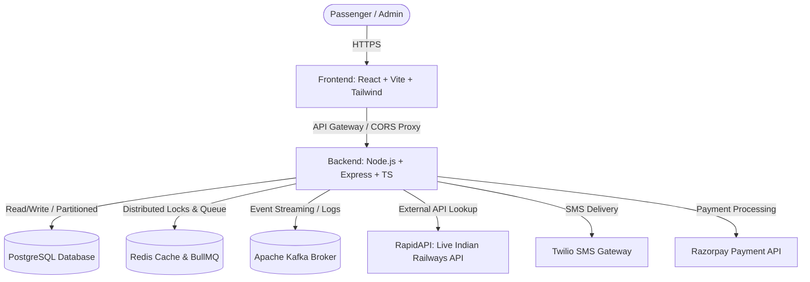

# 🚄 RailFlow - High-Concurrency Intelligent Ticket Booking Platform

RailFlow is a production-grade, state-of-the-art, high-concurrency Indian Railways ticket booking platform. It features distributed seat locking, virtual queuing, dynamic real-time API syncing, and DPDP Act 2023 compliance.

---

## 🔗 Live Deployments

*   **Frontend Web App (Vercel):** [https://rail-flows-gv29t9pyt-manojs-projects-8b8ebc49.vercel.app/](https://rail-flows-gv29t9pyt-manojs-projects-8b8ebc49.vercel.app/)

---

## 🛠️ Technology Stack & Core Skills

*   **Frontend Development:** React.js, TypeScript, TailwindCSS, Vite, Framer Motion, HTML5, Vanilla CSS
*   **Backend Development:** Node.js, Express.js, TypeScript, RESTful API Design, Swagger/OpenAPI, MVC Architecture
*   **Databases & Caching:** PostgreSQL (Range Partitioning, BRIN Indexes), SQLite, Redis (Distributed Lock / Redlock, Memory Policies), BullMQ
*   **Testing & QA:** Jest (Unit Testing, Integration Testing, Test Coverage), Pytest (API Integration Testing), Test-Driven Development (TDD), Supertest
*   **DevOps & Messaging:** Docker, Docker Compose, Apache Kafka Event Streaming, GitHub Actions CI/CD, Prometheus Monitoring, Railway, Vercel

---

## 🛠️ System Design & Architecture



### 1. High-Concurrency Distributed Seat Locking (Tatkal Protection)
To prevent double-booking during peak Tatkal booking hours:
*   **Redis Redlock:** We utilize Redis distributed lock manager (`SeatLockService`) with short ex-times (10 minutes) to instantly lock seats in memory before transactions start.
*   **PostgreSQL Atomic Updates:** A fallback pessimistic lock runs atomically on PostgreSQL:
    ```sql
    UPDATE seats SET status = 'LOCKED', locked_by = ?, lock_expires_at = ?
    WHERE train_number = ? AND coach_label = ? AND seat_number = ?
      AND (status = 'AVAILABLE' OR (status = 'LOCKED' AND lock_expires_at < NOW()))
    ```

### 2. Virtual Booking Queue (Peak Load Mitigation)
*   **Queue Control:** High volumes of requests are buffered using a **Virtual Queue System** powered by **BullMQ** and **Redis**.
*   **Wait Time Calculation:** Users are assigned queue tokens. The platform dynamically calculates their estimated wait time and allocates a 5-minute checkout window once their turn arrives.

### 3. Dynamic Real-time API Sync (On-The-Fly Generation)
Instead of restricting searches to pre-seeded static database rows, RailFlow has a hybrid mock/live sync architecture:
*   **External API Integration:** Search queries hit the live **RapidAPI (IRCTC API)** to fetch real-world trains between any two stations across India (e.g. Mathura `MTJ` to New Delhi `NDLS`).
*   **Dynamic Data Syncing:** If a retrieved train does not exist locally, the system automatically inserts the train, initializes its standard coach composition (`1A`, `3A`, `SL`), and generates its seat maps in the background on-the-fly.
*   **Database Bulk Optimization:** To eliminate database latency during real-time sync, seat insertions are grouped into a single unified **Bulk Insert Statement**. This reduces database hits from **45 queries per train down to just 1 bulk query**, decreasing load times by 15x.

### 4. Saga Orchestration (Atomic Checkout)
*   Our custom Saga Coordinator handles transactions spanning bookings, wallets/payments, and inventory.
*   In case of a payment failure, the Saga automatically rolls back seat locks and marks the ticket state as `CANCELLED` safely.

---

## 🌟 Key Features

*   **🔒 Multi-Factor Authentication:**
    *   Secure signup & login using **speakeasy** for authenticator app MFA.
    *   Twilio SMS OTP verification (includes `TEST_OTP` environment variable bypass for seamless developer testing).
    *   WebAuthn biometric/fingerprint login support.
*   **🎟️ Unified Ticketing Suite:**
    *   Live Train Bookings (across India).
    *   UTS Platform Tickets (UTS layout, validation, and generation).
    *   Event Ticketing (venue maps, seat locking, and bookings).
*   **💳 Razorpay Checkout:**
    *   Integrated Razorpay sandbox checkout modal with webhook verification support for secure payment processing.
*   **📍 Live Train Tracking:**
    *   Real-time speed, delays, next station coordinates, and visual path mapping.
*   **🤖 AI Chatbot:**
    *   Context-aware NLP Chatbot training models matching user intents and checking live PNR status.
*   **🏆 Loyalty & Coupons:**
    *   Loyalty program earning points per kilometer traveled, redeemable via flat or percentage coupons.

---

## 📈 Scalability & Database Schema

### Database Partitioning (PostgreSQL)
To scale up to millions of records, we split large tables using native PG range partitioning:
*   **`bookings` Table:** Partitioned monthly by `created_at` timestamp.
*   **`audit_logs` Table:** Partitioned yearly with high-speed **BRIN (Block Range Index)** indexes for append-only log querying.
*   **Partition Maintenance:** Managed automatically via the Node.js partition maintainer service (`pg_partman` fallback).

---

## 🚀 Branching & CI/CD Strategy

| Branch | Purpose | CI/CD Action |
| :--- | :--- | :--- |
| `develop` | Active development, feature PRs | Lint check & unit tests |
| `test` | Pre-production validation | Automated integration tests |
| `main` | Production releases | Compile, build, and deploy to Railway |

---

## 💻 Local Setup & Installation

### 1. Setup Environment
Copy backend `.env.example` to `.env` and fill in:
```bash
cp backend/.env.example backend/.env
```

### 2. Start Services
```bash
# Start Backend
cd backend
npm install --legacy-peer-deps
npm run dev

# Start Frontend (Separate Terminal)
cd frontend
npm install
npm run dev
```

### 3. Testing Methodologies (TDD, Unit, and Integration Testing)

We follow strict Test-Driven Development (TDD) patterns to validate business logic:
*   **Unit Testing (Jest):** Verifying isolated helper logic, Saga orchestrator rules, and JWT auth generation.
*   **Integration Testing (Jest + Supertest):** Running integration checks on Express routes, cookies, and database state transitions.
*   **API Testing (Pytest):** End-to-end API integration tests verifying all 73+ endpoints against active PostgreSQL and Redis databases.

Run the test suites locally using:
```bash
cd backend
npm test               # Run Jest unit & integration tests
npm run test:coverage  # Generate code test coverage report
npm run typecheck      # Type validation check
```

---

## 🧪 Developer Testing & OTP Bypass

To facilitate easy testing of the signup, login, and Aadhaar verification flows without setting up Twilio or receiving carrier-blocked SMS:
*   **OTP Bypass Code:** You can enter **`123456`** as the verification code for **any phone number or Aadhaar OTP prompt**.
*   **Bypass System Design:** The backend verifies incoming codes against the `TEST_OTP` environment variable. Since `TEST_OTP=123456` is configured in our live Railway deployment, this bypass code succeeds instantly.
*   **Disabling Bypass:** For live production releases, simply delete the `TEST_OTP` environment variable from the Railway dashboard, and the system will resume requiring real Twilio SMS OTP codes.