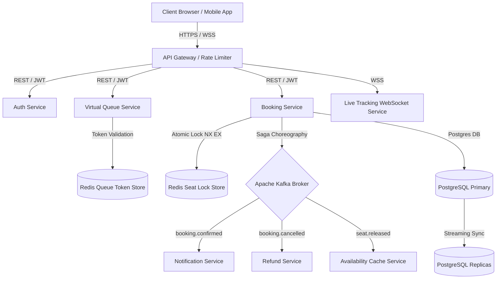

# RailFlow System Architecture & Robustness Design

This document details the system architecture of RailFlow (v2.0 — Enhanced Security Edition) based on the latest codebase implementations and outlines design recommendations to maximize robustness and reliability under extreme load.

---

## 1. System Architecture Overview

RailFlow utilizes a high-throughput, event-driven microservices architecture designed to support over 5 million concurrent users during peak booking surges (e.g., Tatkal hours).



---

## 2. Core Subsystem Workflows

### 2.1 Virtual Queue & Traffic Staggering
To prevent service degradation during traffic spikes, the **Virtual Queue Service** intercepts incoming booking requests.
- **Queue Token Bindings**: Tokens are cryptographically bound to the user's `user_id`, IP address, and device fingerprint.
- **Fairness Guarantee**: Tokens enforce a strict booking window (`booking_window_expires_at` using `TIMESTAMPTZ`). If a user attempts to refresh, they are returned the same queue token rather than a new position.
- **Abuse Control**: Rapid refreshes or queue tampering automatically trigger a 30-minute IP and account lockout.

### 2.2 Redis Seat Lock Engine
Double-booking is prevented at the database-layer by utilizing an atomic distributed locking mechanism in Redis:
- **Lock Acquisition**: Executed via single atomic operation `SET key value NX EX 180` (180-second TTL).
- **Lock Release**: Managed via a safe Lua script that compares the lock owner token before deleting the key. This ensures a client cannot release a lock acquired by another client after their own lock expires.
- **PostgreSQL Advisory Lock Fallback**: If Redis connectivity degrades, the lock service dynamically degrades to PostgreSQL transaction-level advisory locks to guarantee safety.

### 2.3 Saga Booking & Payment Orchestration
RailFlow implements a choreography-based Saga Pattern to maintain data consistency across booking and payment service segments without holding database connections open.
1. **Seats Locked**: Booking initialized, seats locked in Redis.
2. **Idempotent Payment**: Payment requests require a unique client-generated `idempotencyKey` preventing double-charging.
3. **Compensating Transactions**: If booking confirmation fails (e.g., database write timeout) after successful payment capture, an automatic refund transaction is emitted via Kafka to return the balance within 60 seconds.

### 2.4 Kafka Event-Driven Messaging
Kafka acts as the central messaging backbone routing asynchronous events between services:
- **DLQ Pattern**: Message handlers retry up to 3 times with exponential backoff. Upon 3 consecutive failures, the message is routed to a corresponding Dead Letter Queue (`booking.confirmed.dlq` or `payment.failed.dlq`) for manual/automated recovery.
- **Partitioning**: Events are partitioned by PNR to guarantee sequential processing for booking-related updates.

### 2.5 Real-Time WebSocket Live Tracking
The **Live Tracking Service** establishes persistent connections (`ws://`) to stream GPS location, delay status, and speed of active trains:
- **Decoupled Simulation**: The live tracking endpoint queries the SQLite/PostgreSQL `live_train_status` database or listens to a Redis Pub/Sub channel to broadcast updates dynamically without querying primary booking tables.

---

## 3. Latest Hardened Security Implementations

| Security Vector | Implementation Detail | Source File Location |
| :--- | :--- | :--- |
| **Google ID Token Verification** | Pinned to RS256; verifies token signature via Google public keys and validates matching client IDs before upserting users by their stable `sub` identifier. | [auth.routes.ts](file:///c:/Users/admin/Desktop/Railflow/backend/src/routes/auth.routes.ts#L400-L470) |
| **TOTP Multi-Factor Authentication** | Uses cryptographically secure base32 secrets generated by `speakeasy` and verified against a 30-second window (with 1-step drift tolerance). | [auth.routes.ts](file:///c:/Users/admin/Desktop/Railflow/backend/src/routes/auth.routes.ts#L504-L614) |
| **Aadhaar Identity Verification** | Replaced simple email checks with an Aadhaar OTP matching flow. Sensitive Aadhaar numbers are masked before database persistence. | [Register.tsx](file:///c:/Users/admin/Desktop/Railflow/frontend/src/features/auth/Register.tsx#L110-L153) |
| **Password Strength Indicator** | Interactive client-side strength assessment requiring minimum lengths, uppercase characters, digits, and special characters. | [Register.tsx](file:///c:/Users/admin/Desktop/Railflow/frontend/src/features/auth/Register.tsx#L72-L92) |

---

## 4. Architectural Enhancements for Maximum Robustness

To make the latest implementation even more robust and effective, the following design modifications are proposed:

### Recommendation A: The Transactional Outbox Pattern (Highly Recommended)
> [!IMPORTANT]
> **Problem**: In the current implementation of `booking.routes.ts` and `kafka.service.ts`, if the database transaction commits successfully but the Kafka broker is down or experiences a network partition, the message is lost (or vice versa, resulting in dual-write inconsistency).

**Solution**: Implement the Transactional Outbox Pattern:
1. Write the booking payload and the outbox event into an `outbox_events` table within the **same** database transaction.
2. A separate, lightweight background relay worker polls the `outbox_events` table, publishes the messages to Kafka, and marks them as processed upon acknowledgment.
3. This guarantees **at-least-once delivery** to Kafka even under network failures.

```
[Booking Request] ──> [DB Transaction]
                         ├──> Insert Booking Record
                         └──> Insert Outbox Event (Pending)
                                   │
                                   ▼ (Database Commit)
                        [Outbox Event Table]
                                   │
                                   ▼ (Read by Outbox Relay Worker)
                             [Kafka Broker]
```

### Recommendation B: Clustered Redis Redlock Pattern
> [!WARNING]
> **Problem**: The current seat lock uses a single-node Redis command (`SET NX EX`). In a clustered Redis environment with master-replica failovers, if a master crashes before syncing the lock key to its replica, a secondary client could acquire the same lock, violating the zero-double-booking guarantee.

**Solution**: Upgrade the lock acquisition to use the **Redlock algorithm** (via a library like `redlock` or custom client pool) to acquire consensus across multiple independent Redis instances before confirming a seat lock.

### Recommendation C: Database Connection Leak Protection
> [!TIP]
> **Problem**: Background routines, such as seat lock cleaning and cache evictions, run inside the main express thread context. An uncaught database exception in these background intervals could leak connection pool handles or crash the master process.

**Solution**:
1. Wrap all background interval sweeps in isolated `try/catch` wrappers.
2. Enforce strict query timeout limits (`statement_timeout` on PostgreSQL) so that hung lock cleanups automatically abort rather than exhausting the connection pool.

### Recommendation D: Dual-Phase Lock Validation before Final Saga Capture
> [!CAUTION]
> **Problem**: Under heavy load, payment capture might take longer than the 180-second lock window. If the lock expires, another client could reserve and book the same seat. If the payment subsequently succeeds, the Saga will capture payment for an already-booked seat.

**Solution**: Add a **Double-Check Lock Validation** step immediately before final payment capture. If the lock has expired, trigger an automated abort and issue an instant refund *before* calling the gateway capture API, ensuring no customer is charged for a booking that cannot be fulfilled.

### Recommendation E: API Rate Limiting - Sliding Window Log
> [!NOTE]
> **Problem**: The current rate limiters (e.g., `authRateLimiter`) use a fixed-window mechanism. Attacking scripts can exploit the boundary window reset to double their request allowance during window crossovers.

**Solution**: Change the rate-limiting store in Redis to use a **Sliding Window Log** (using Redis sorted sets `ZADD` with timestamps). This ensures that requests are checked against a true moving window, mitigating burst-abuse vectors on authentication routes.
